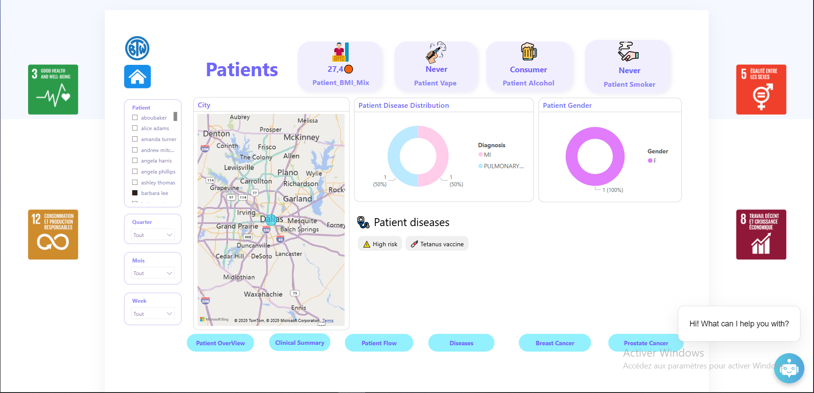
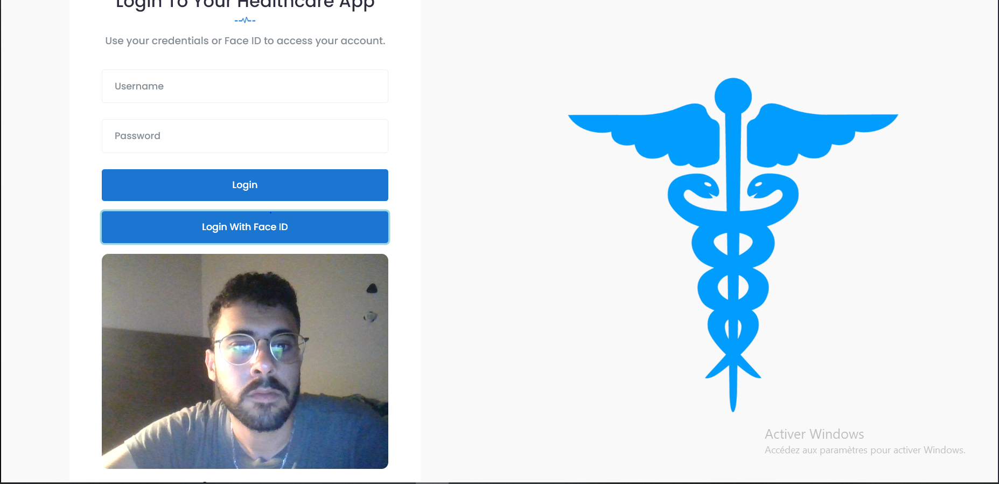
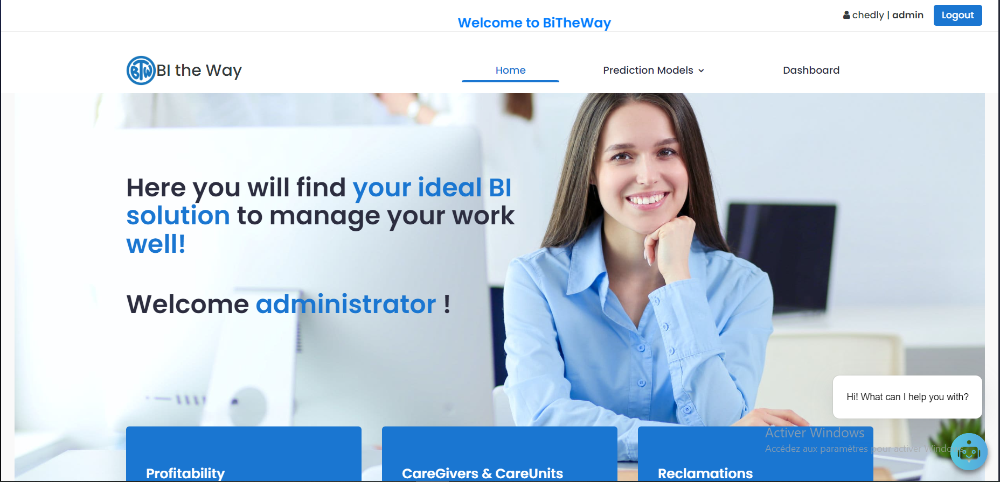
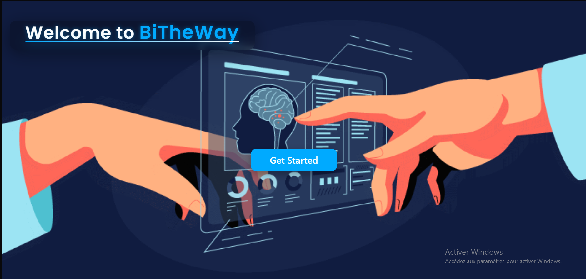
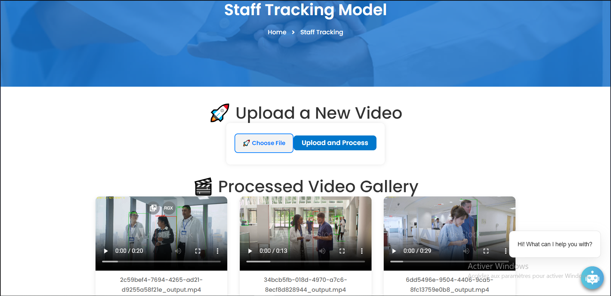
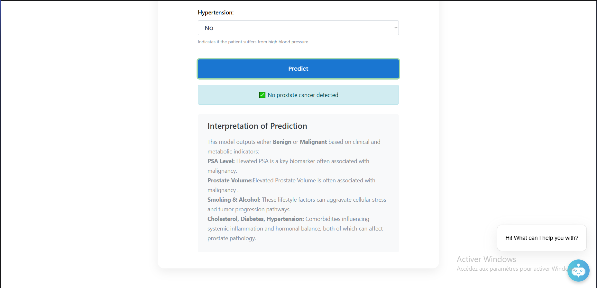

# 🏥 HealthCare_Bi – Data & BI Intelligence for Hospitals

## 📊 Project Overview
**HealthCare_Bi** is an end-to-end **Business Intelligence & Machine Learning solution** designed for healthcare organizations.  
It integrates **Power BI dashboards**, **Python analytics notebooks**, and **predictive models** to provide insights into patient care, resource allocation, and hospital efficiency.

---

## 🚀 Features
- 📈 Data analysis, cleaning, and visualization with Python (Pandas, Matplotlib)
- 🤖 Predictive modeling for patient stay duration and resource forecasting
- 📊 Interactive Power BI dashboard with KPIs and drill-down capabilities
- 🔄 DAX scripts for dynamic measures and time intelligence
- 🌐 (Optional) Web interface/API for deployment (if `src/` is a Flask/Node app)

---

## 📸 Project Preview

## 📸 Dashboard Preview

  

  

  

  

  

  

  

  

  

  

